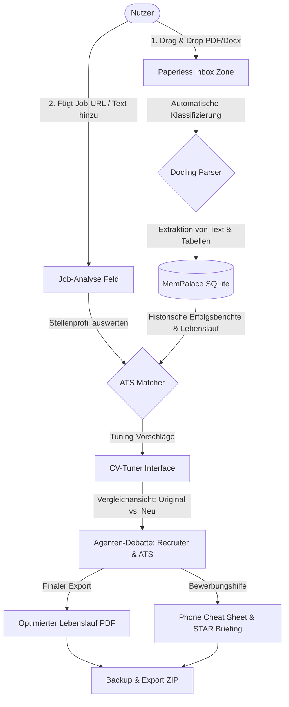

# NALA Career-Ops Desktop: How-To Guide / Bedienungsanleitung

> **Language / Sprache / Langue / Lingua:** [English](#english-user-guide) | [Deutsch](#deutsch-bedienungsanleitung) | [Français](#français-guide-de-lutilisateur) | [Italiano](#italiano-guida-alluso)

---

## Deutsch: Bedienungsanleitung

Diese Anleitung erklärt Schritt für Schritt, wie Sie die NALA Career-Ops Desktop-Anwendung installieren, einrichten und nutzen.

### 🗺️ Dokumentenfluss (Mermaid Diagramm)

Das folgende Diagramm zeigt den genauen Weg Ihrer Dokumente von der Inbox bis zum fertigen Bewerbungs-Paket:

---

### 1. Doppelklick-Installation auf Windows
1. Laden Sie die Datei `NALA-Career-Ops-Setup.exe` aus den GitHub Releases herunter.
2. Klicken Sie doppelt auf die Datei.
3. Der Windows-Installationsassistent öffnet sich und installiert das Programm automatisch unter `%LOCALAPPDATA%/Programs/Nala-Career-Ops`.
4. Nach Abschluss finden Sie ein Desktop-Symbol namens **NALA Career-Ops**. Klicken Sie doppelt darauf, um das Programm zu starten.

---

### 2. KI-Modelle einrichten (Local & Cloud)
Öffnen Sie das Programm und klicken Sie links unten auf das **Zahnrad-Symbol (Einstellungen)**:

#### A) Lokale Modelle (Ollama / LM Studio)
- Stellen Sie sicher, dass **Ollama** auf Ihrem Computer läuft (`Ollama App` im Hintergrund geöffnet).
- Klicken Sie auf **"Lokale Modelle suchen"**. Die App scannt Port `11434` und lädt Ihre installierten Modelle (z. B. `qwen3:32b`, `llama3`).
- Wählen Sie Ihr Standard-Modell aus.

#### B) Cloud-Modelle (Gemini / OpenAI)
- Tragen Sie Ihren API-Schlüssel in das entsprechende Feld ein (z. B. `Gemini API Key`).
- Ihre Schlüssel werden sicher und verschlüsselt in Ihrer lokalen Einstellungsdatei gespeichert.

---

### 3. Drag-and-Drop Inbox nutzen
1. Navigieren Sie im Menü links zum Bereich **Inbox**.
2. Ziehen Sie Ihre Bewerbungsdokumente per Drag-and-Drop in das markierte Feld:
   - Aktueller Lebenslauf (`Lebenslauf_2026.pdf`)
   - Arbeitszeugnisse (`Zeugnis_Firma_A.docx`)
   - Diplome & Zertifikate (`Zertifikat_Cloud.pdf`)
3. Das Programm analysiert die Dateien im Hintergrund mit **Docling** und speichert die extrahierten Texte in Ihrer lokalen **MemPalace-Datenbank**.
4. Die Dokumente erhalten automatisch Tags (z. B. `#cv`, `#zeugnis`).

---

### 4. CV-Tuning & HR-Simulation starten
1. Gehen Sie auf den Reiter **CV-Tuner**.
2. Fügen Sie den Text oder die URL der gewünschten Stellenanzeige ein.
3. Wählen Sie Ihren Lebenslauf aus der Liste Ihrer importierten Dokumente.
4. Klicken Sie auf **"Tuning & Simulation starten"**:
   - Der **ATS-Matcher** bewertet die Relevanz Ihrer Fähigkeiten (Score A bis F).
   - Das **HR-Debate Team** simuliert die Meinung eines Personalers, Fachbereichsleiters und eines Roboter-Scanners (ATS).
5. Überprüfen Sie im Split-Screen die vorgeschlagenen Anpassungen und übernehmen Sie diese mit einem Klick.

---

### 5. Telefon-Spickzettel (Phone Cheat Sheet) erstellen
1. Nach der Optimierung können Sie im Bereich **Interview Coach** auf **"Telefon-Spickzettel generieren"** klicken.
2. Dies erzeugt eine kompakte Liste, die Sie ausdrucken oder auf Ihrem Smartphone anzeigen können:
   - **STAR-Beispiele:** Kurze Antworten für kritische Fragen (Situation, Task, Action, Result).
   - **TALK-Points:** Ihre 3 stärksten Erfolge, exakt passend zur Stelle.
   - **Fragen an die Firma:** Clevere Fragen, die Sie im Gespräch stellen können.

---

### 6. Daten sichern (Import & Export)
- **Komplett-Backup:** Klicken Sie in den Einstellungen auf **"Daten exportieren"**, um alle Dokumente, Bewerbungen und MemPalace-Daten als verschlüsselte `.zip` zu sichern.
- **Einzel-Job-Export:** Exportieren Sie eine spezifische Bewerbung inklusive des maßgeschneiderten Lebenslaufs, Anschreibens und des Profil-Scoring-Reports als PDF-Paket.

---
---

## English: User Guide

This guide explains step-by-step how to install, configure, and use the NALA Career-Ops Desktop application.

### 🗺️ Document Flow

*Please refer to the Mermaid diagram in the German section above for a visual representation of how your documents flow through the system.*

---

### 1. Double-Click Installation on Windows
1. Download the `NALA-Career-Ops-Setup.exe` file from the GitHub Releases page.
2. Double-click the downloaded file.
3. The Windows installer will open and automatically install the application under `%LOCALAPPDATA%/Programs/Nala-Career-Ops`.
4. Once completed, a desktop icon named **NALA Career-Ops** will appear. Double-click it to launch the app.

---

### 2. Setting Up AI Models (Local & Cloud)
Open the application and click the **Gear Icon (Settings)** at the bottom left:

#### A) Local Models (Ollama / LM Studio)
- Ensure **Ollama** is running on your computer (Ollama app active in the background).
- Click **"Scan Local Models"**. The app will scan port `11434` and retrieve your installed models (e.g., `qwen3:32b`, `llama3`).
- Select your preferred default model.

#### B) Cloud Models (Gemini / OpenAI)
- Enter your API Key into the designated field (e.g., `Gemini API Key`).
- Your keys are saved securely in your local settings file.

---

### 3. Using the Drag-and-Drop Inbox
1. Navigate to the **Inbox** tab on the left sidebar.
2. Drag and drop your application documents into the marked drop-zone:
   - Current Resume/CV (`resume_2026.pdf`)
   - Work certificates (`reference_company_a.docx`)
   - Diplomas & certifications (`cloud_certificate.pdf`)
3. The app parses the files in the background using **Docling** and stores the extracted content in your local **MemPalace database**.
4. Files are automatically tagged (e.g., `#cv`, `#certificate`).

---

### 4. Running CV Tuning & HR Simulation
1. Go to the **CV-Tuner** tab.
2. Paste the text or paste the URL of the target job listing.
3. Select your resume from the list of imported documents.
4. Click **"Start Tuning & Simulation"**:
   - The **ATS Matcher** scores your profile's fit (Grade A to F).
   - The **HR Debate Team** simulates feedback from a recruiter, hiring manager, and ATS scanner.
5. Review the proposed modifications side-by-side and apply changes with a single click.

---

### 5. Generating a Phone Cheat Sheet
1. After tuning, go to the **Interview Coach** section and click **"Generate Phone Cheat Sheet"**.
2. This creates a compact briefing card to print or view on your phone:
   - **STAR Examples:** Direct answers for tough questions (Situation, Task, Action, Result).
   - **TALK Points:** Your top 3 achievements aligned with the role.
   - **Smart Questions:** Questions to ask the interviewer.

---

### 6. Backing Up and Exporting Data
- **Full Backup:** Click **"Export All Data"** in Settings to save all documents, applications, and MemPalace memories into a secure `.zip` file.
- **Single Job Export:** Export a specific job application package including the tailored resume, cover letter, and scoring reports.

---
---

## Français: Guide de l'utilisateur

Ce guide explique étape par étape comment installer, configurer et utiliser l'application NALA Career-Ops Desktop.

### 🗺️ Flux de documents

*Veuillez vous référer au diagramme Mermaid dans la section Deutsch ci-dessus pour une représentation visuelle de la façon dont vos documents transitent par le système.*

---

### 1. Installation par double-clic sur Windows
1. Téléchargez le fichier `NALA-Career-Ops-Setup.exe` depuis la page des GitHub Releases.
2. Double-cliquez sur le fichier téléchargé.
3. L'assistant d'installation s'ouvre et installe automatiquement l'application sous `%LOCALAPPDATA%/Programs/Nala-Career-Ops`.
4. Une fois l'installation terminée, une icône de bureau nommée **NALA Career-Ops** apparaît. Double-cliquez dessus pour lancer l'application.

---

### 2. Configuration des modèles d'IA (locaux et cloud)
Ouvrez l'application et cliquez sur l'**icône d'engrenage (Paramètres)** en bas à gauche :

#### A) Modèles locaux (Ollama / LM Studio)
- Assurez-vous que **Ollama** fonctionne sur votre ordinateur (application Ollama active en arrière-plan).
- Cliquez sur **"Rechercher des modèles locaux"**. L'application scanne le port `11434` et récupère vos modèles installés (par exemple, `qwen3:32b`, `llama3`).
- Sélectionnez votre modèle par défaut préféré.

#### B) Modèles cloud (Gemini / OpenAI)
- Saisissez votre clé API dans le champ correspondant (par exemple, `Clé API Gemini`).
- Vos clés sont enregistrées de manière sécurisée dans votre fichier de configuration local.

---

### 3. Utilisation de l'Inbox Glisser-Déposer
1. Naviguez vers l'onglet **Inbox** dans la barre latérale gauche.
2. Glissez-déposez vos documents de candidature dans la zone de dépôt indiquée :
   - CV actuel (`cv_2026.pdf`)
   - Certificats de travail (`certificat_travail_entreprise_a.docx`)
   - Diplômes et certifications (`certificat_cloud.pdf`)
3. L'application analyse les fichiers en arrière-plan avec **Docling** et enregistre le contenu extrait dans votre **base de données locale MemPalace**.
4. Les fichiers sont automatiquement étiquetés (par exemple, `#cv`, `#certificat`).

---

### 4. Lancement de l'Optimisation de CV & de la Simulation RH
1. Allez sur l'onglet **CV-Tuner**.
2. Collez le texte ou collez l'URL de l'offre d'emploi ciblée.
3. Sélectionnez votre CV dans la liste des documents importés.
4. Cliquez sur **"Démarrer l'optimisation & la simulation"** :
   - L'**ATS Matcher** évalue la pertinence de votre profil (Score de A à F).
   - L'**équipe de débat RH** simule les commentaires d'un recruteur, d'un responsable du recrutement et d'un scanner ATS.
5. Examinez les modifications proposées côte à côte et appliquez-les d'un simple clic.

---

### 5. Génération d'un Spicilège Téléphonique (Cheat Sheet)
1. Après l'optimisation, allez dans la section **Interview Coach** et cliquez sur **"Générer le spicilège téléphonique"**.
2. Cela crée une fiche d'information compacte à imprimer ou à consulter sur votre téléphone :
   - **Exemples STAR :** Réponses directes pour les questions difficiles (Situation, Tâche, Action, Résultat).
   - **Points de discussion (TALK) :** Vos 3 meilleures réalisations alignées avec le rôle.
   - **Questions intelligentes :** Questions pertinentes à poser à l'interviewer.

---

### 6. Sauvegarde et Exportation des données
- **Sauvegarde complète :** Cliquez sur **"Exporter toutes les données"** dans les Paramètres pour enregistrer tous les documents, candidatures et souvenirs MemPalace dans un fichier `.zip` sécurisé.
- **Exportation d'une candidature unique :** Exportez un dossier de candidature spécifique comprenant le CV personnalisé, la lettre de motivation et les rapports d'évaluation.

---
---

## Italiano: Guida all'uso

Questa guida spiega passo dopo passo come installare, configurare e utilizzare l'applicazione NALA Career-Ops Desktop.

### 🗺️ Flusso dei documenti

*Si prega di fare riferimento al diagramma Mermaid nella sezione Deutsch sopra per una rappresentazione visiva di come i vostri documenti transitano attraverso il sistema.*

---

### 1. Installazione con doppio clic su Windows
1. Scaricare il file `NALA-Career-Ops-Setup.exe` dalla pagina delle GitHub Releases.
2. Fare doppio clic sul file scaricato.
3. L'installatore si aprirà e installerà automaticamente l'applicazione in `%LOCALAPPDATA%/Programs/Nala-Career-Ops`.
4. Al termine dell'operazione, apparirà un'icona sul desktop chiamata **NALA Career-Ops**. Fare doppio clic su di essa per avviare l'applicazione.

---

### 2. Configurazione dei modelli IA (locali e cloud)
Aprire l'applicazione e fare clic sull'**icona dell'ingranaggio (Impostazioni)** in basso a sinistra:

#### A) Modelli locali (Ollama / LM Studio)
- Assicurarsi che **Ollama** sia in esecuzione sul computer (applicazione Ollama attiva in background).
- Fare clic su **"Scansiona modelli locali"**. L'applicazione scansionerà la porta `11434` e recupererà i modelli installati (ad esempio, `qwen3:32b`, `llama3`).
- Selezionare il modello predefinito preferito.

#### B) Modelle cloud (Gemini / OpenAI)
- Inserire la propria chiave API nel campo designato (ad esempio, `Chiave API Gemini`).
- Le chiavi vengono salvate in modo sicuro nel file di configurazione locale.

---

### 3. Utilizzo della Inbox Drag-and-Drop
1. Navigare alla scheda **Inbox** nella barra laterale sinistra.
2. Trascinare e rilasciare i documenti di candidatura nella zona indicata:
   - CV attuale (`cv_2026.pdf`)
   - Certificati di lavoro (`certificato_lavoro_azienda_a.docx`)
   - Diplomi e certificazioni (`certificazione_cloud.pdf`)
3. L'applicazione analizza i file in background con **Docling** e memorizza il contenuto estratto nel vostro **database locale MemPalace**.
4. I file vengono taggati automaticamente (ad esempio, `#cv`, `#certificato`).

---

### 4. Avvio dell'Ottimizzazione del CV & della Simulazione Risorse Umane
1. Andare alla scheda **CV-Tuner**.
2. Incollare il testo o l'URL dell'offerta di lavoro ciblata.
3. Selezionare il proprio curriculum dall'elenco dei documenti importati.
4. Fare clic su **"Avvia ottimizzazione & simulazione"**:
   - L'**ATS Matcher** valuta la rilevanza del vostro profilo (punteggio da A a F).
   - Il **team di dibattito delle Risorse Umane** simula i commenti di un selezionatore, di un responsabile delle assunzioni e di uno scanner ATS.
5. Esaminare le modifiche proposte affiancate e applicarle con un solo clic.

---

### 5. Generazione di un Foglietto di Aiuto Telefonico (Cheat Sheet)
1. Dopo l'ottimizzazione, andare alla sezione **Interview Coach** e fare clic su **"Genera foglietto di aiuto"**.
2. Questo crea una scheda informativa compatta da stampare o visualizzare sul proprio smartphone:
   - **Esempi STAR:** Risposte dirette per domande difficili (Situazione, Compito, Azione, Risultato).
   - **Punti di discussione (TALK):** I vostri 3 migliori successi allineati con il ruolo.
   - **Domande intelligenti:** Domande intelligenti da porre all'intervistatore.

---

### 6. Backup ed Esportazione dei dati
- **Backup completo:** Fare clic su **"Esporta tutti i dati"** nelle Impostazioni per salvare tutti i documenti, le candidature e i ricordi di MemPalace in un file `.zip` sicuro.
- **Esportazione di una singola candidatura:** Esportare un pacchetto di candidatura specifico comprendente il CV personalizzato, la lettera di presentazione e i rapporti di valutazione.
