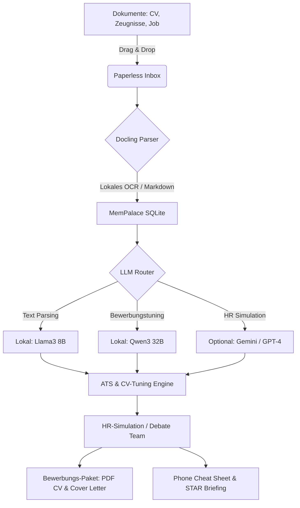

# NALA Career-Ops Desktop (NALA-CV-tUnEr-career-OPS)

  

> **Language / Sprache / Langue / Lingua:** [English](#english) | [Deutsch](#deutsch) | [Français](#français) | [Italiano](#italiano)

---

## Deutsch

### 🌟 Übersicht & Vision
**NALA Career-Ops Desktop** macht das leistungsstarke, KI-gesteuerte Jobsuche- und Bewerbungs-System von [career-ops](https://github.com/santifer/career-ops) für jedermann nutzbar. Mit einer modernen, lokalen Benutzeroberfläche (Windows 11 Fluent Look) können Dokumente einfach per Drag-and-Drop verarbeitet werden.

Das System integriert den **NALA-CV-Tuner**, **Docling** für intelligente Dokumentenanalyse, **MemPalace** für persönliche Karrierehistorie, **NALA-MCP** für die NALA-Systemintegration und **Ollama** für vollkommen lokale KI-Modelle.

---

### 📦 Download & Installation (Kein Terminal benötigt!)
> [!IMPORTANT]
> Sie müssen **keinen** Programmcode selbst kompilieren oder NodeJS installieren.
> Fertige Installationspakete finden Sie direkt unter **GitHub Releases**:
> - 💾 **Windows:** `NALA-Career-Ops-Setup.exe` (Doppelklick zum Installieren)
> - 🍏 **macOS:** `NALA-Career-Ops.dmg` (In Programme-Ordner ziehen)
> - 🐧 **Linux:** `NALA-Career-Ops.AppImage` (Ausführbar machen und starten)

---

### 🦧 CaveMAN Modus (Einfache Anleitung)
*Für Anwender, die eine schnelle, unkomplizierte Lösung ohne Fachbegriffe suchen.*

1. **Öffnen:** Doppelklicken Sie auf das installierte Programmsymbol auf Ihrem Desktop.
2. **KI verbinden:** Gehen Sie zu den **Einstellungen** (Zahnrad-Symbol) und wählen Sie **Ollama** (für lokale KI) oder tragen Sie Ihren **Gemini/ChatGPT API-Schlüssel** ein.
3. **Dokumente ablegen:** Ziehen Sie Ihren aktuellen Lebenslauf (CV), Arbeitszeugnisse und die Stellenanzeige (PDF oder Textdatei) direkt in die **große grüne Box (Inbox)**.
4. **Optimieren:** Klicken Sie auf **"Bewerbung optimieren"**.
5. **Ergebnis:** Das Programm erstellt automatisch einen verbesserten Lebenslauf, ein Anschreiben und einen Telefon-Spickzettel (Cheat Sheet).

---

### 🧠 Experte Modus (Technische Details)
*Für Entwickler und Power-User, die Pfade, Sicherheitslimits und Architekturen anpassen möchten.*

#### 📁 Lokale Datenpfade
- **Konfigurationsdaten:** `%APPDATA%/Nala-Career-Ops/settings.json` (Windows) oder `~/Library/Application Support/Nala-Career-Ops/settings.json` (macOS).
- **Lokale Datenbank (MemPalace & Inbox):** SQLite-Datenbank unter `%LOCALAPPDATA%/Nala-Career-Ops/db/career_ops.sqlite`.

#### 🔌 Ports & Dienste
- **Ollama API:** Standardmäßig unter `http://localhost:11434`.
- **NALA-MCP Core:** Standardverbindung unter `http://localhost:3000` (Read-only standardmäßig).

#### 🛡️ Datenschutz & Git-Sicherheit (R3-Protokoll)
Dieses Repository enthält ein striktes Pre-Commit-Skript (`scripts/git-gate.js`). Es durchsucht alle Code-Änderungen auf sensible Personendaten, Bilder, private API-Schlüssel oder absolute Pfade vor dem Push auf GitHub, um Datenlecks zu verhindern.

---

### 🗺️ Arbeitsablauf (Mermaid Diagramm)

---

### ❓ FAQ (Häufige Fragen)
* **Kostet die Nutzung etwas?** Nein. Wenn Sie Ollama mit lokalen Modellen nutzen, ist die App zu 100 % kostenlos und offline nutzbar.
* **Wo liegen meine Daten?** Alle Lebensläufe und Texte verbleiben auf Ihrem eigenen Computer in der lokalen SQLite-Datenbank.

---

### ⚠️ Sicherheitshinweise
* Lokale Modelle benötigen eine Grafikkarte (GPU) mit ausreichend Videospeicher (empfohlen: min. 8GB VRAM für 8B-Modelle, 16GB+ VRAM für 32B-Modelle).
* Führen Sie vor einem Git-Commit immer `npm run check-privacy` aus.

---
---

## English

### 🌟 Overview & Vision
**NALA Career-Ops Desktop** turns the powerful, AI-driven job search and application pipeline from [career-ops](https://github.com/santifer/career-ops) into an accessible desktop application. Featuring a modern, local user interface styled in Windows 11 Fluent Design, documents can be processed seamlessly via drag-and-drop.

The app integrates **NALA-CV-Tuner**, **Docling** for document understanding, **MemPalace** for personal career history, **NALA-MCP** for ecosystem connectivity, and **Ollama** for running 100% local AI models.

---

### 📦 Download & Installation (No Terminal Required!)
> [IMPORTANT]
> You do **not** need to compile any code or install NodeJS manually.
> Pre-compiled installation packages are available directly via **GitHub Releases**:
> - 💾 **Windows:** `NALA-Career-Ops-Setup.exe` (Double-click to install)
> - 🍏 **macOS:** `NALA-Career-Ops.dmg` (Drag to Applications folder)
> - 🐧 **Linux:** `NALA-Career-Ops.AppImage` (Make executable and run)

---

### 🦧 CaveMAN Mode (Quick Start Guide)
*For users looking for a simple, jargon-free way to run the application.*

1. **Open:** Double-click the program icon on your desktop.
2. **Connect AI:** Go to **Settings** (gear icon) and select **Ollama** (local AI) or enter your **Gemini/ChatGPT API key**.
3. **Drop Files:** Drag your current CV, certificates, and the job description (PDF or text files) directly into the **large green box (Inbox)**.
4. **Optimize:** Click **"Optimize Application"**.
5. **Get Results:** The program automatically generates an optimized CV, a tailored cover letter, and a phone cheat sheet.

---

### 🧠 Expert Mode (Technical Details)
*For developers and power users interested in paths, safety limits, and architectures.*

#### 📁 Local Paths
- **Config Storage:** `%APPDATA%/Nala-Career-Ops/settings.json` (Windows) or `~/Library/Application Support/Nala-Career-Ops/settings.json` (macOS).
- **SQLite Database (MemPalace & Inbox):** `%LOCALAPPDATA%/Nala-Career-Ops/db/career_ops.sqlite`.

#### 🔌 Ports & Services
- **Ollama API:** Default endpoint `http://localhost:11434`.
- **NALA-MCP Core:** Default endpoint `http://localhost:3000` (read-only by default).

#### 🛡️ Privacy & Git Security (R3 Protocol)
This repository includes a strict pre-commit script (`scripts/git-gate.js`). It scans all staged changes for sensitive personal data, photos, API keys, or absolute system paths before pushing to GitHub.

---

### 🗺️ Workflow (Mermaid Diagram)

*Please refer to the diagram in the German section above.*

---

### ❓ FAQ (Frequently Asked Questions)
* **Is this free to use?** Yes. If you use Ollama with local models, the app is 100% free and runs entirely offline.
* **Where is my data stored?** All your resumes, certificates, and analysis results remain on your local computer inside the SQLite database.

---

### ⚠️ Safety Notes
* Local models require a compatible GPU with sufficient video memory (min. 8GB VRAM for 8B models, 16GB+ VRAM for 32B models recommended).
* Always run `npm run check-privacy` before committing code to Git.

---
---

## Français

### 🌟 Aperçu & Vision
**NALA Career-Ops Desktop** transforme le puissant pipeline automatisé de recherche d'emploi et de candidature de [career-ops](https://github.com/santifer/career-ops) en une application de bureau accessible. Grâce à une interface utilisateur moderne et locale conçue selon les principes du Fluent Design de Windows 11, vos documents peuvent être traités en toute simplicité par simple glisser-déposer.

L'application intègre **NALA-CV-Tuner**, **Docling** pour l'analyse intelligente des documents, **MemPalace** pour l'historique de votre carrière personnelle, **NALA-MCP** pour la connectivité avec l'écosystème NALA, et **Ollama** pour l'exécution de modèles d'IA 100 % locaux.

---

### 📦 Téléchargement & Installation (Aucun terminal requis !)
> [!IMPORTANT]
> Vous n'avez **pas** besoin de compiler de code ou d'installer NodeJS manuellement.
> Des paquets d'installation pré-compilés sont disponibles directement via les **GitHub Releases** :
> - 💾 **Windows :** `NALA-Career-Ops-Setup.exe` (Double-cliquez pour installer)
> - 🍏 **macOS :** `NALA-Career-Ops.dmg` (Glissez dans le dossier Applications)
> - 🐧 **Linux :** `NALA-Career-Ops.AppImage` (Rendre exécutable et lancer)

---

### 🦧 Mode CaveMAN (Guide de démarrage rapide)
*Pour les utilisateurs recherchant une méthode simple, sans jargon technique.*

1. **Ouvrir :** Double-cliquez sur l'icône de l'application sur votre bureau.
2. **Connecter l'IA :** Allez dans les **Paramètres** (icône d'engrenage) et sélectionnez **Ollama** (IA locale) ou saisissez votre **clé API Gemini/ChatGPT**.
3. **Déposer les fichiers :** Glissez votre CV actuel, vos certificats de travail et l'offre d'emploi (fichiers PDF ou texte) directement dans la **grande zone verte (Inbox)**.
4. **Optimiser :** Cliquez sur **"Optimiser la candidature"**.
5. **Résultats :** Le programme génère automatiquement un CV optimisé, une lettre de motivation sur mesure et un spicilège (cheat sheet) téléphonique.

---

### 🧠 Mode Expert (Détails techniques)
*Pour les développeurs et les utilisateurs avancés intéressés par les chemins, les limites de sécurité et les architectures.*

#### 📁 Chemins locaux
- **Stockage de configuration :** `%APPDATA%/Nala-Career-Ops/settings.json` (Windows) ou `~/Library/Application Support/Nala-Career-Ops/settings.json` (macOS).
- **Base de données SQLite (MemPalace & Inbox) :** `%LOCALAPPDATA%/Nala-Career-Ops/db/career_ops.sqlite`.

#### 🔌 Ports & Services
- **API Ollama :** Point de terminaison par défaut `http://localhost:11434`.
- **NALA-MCP Core :** Point de terminaison par défaut `http://localhost:3000` (lecture seule par défaut).

#### 🛡️ Confidentialité & Sécurité Git (Protocole R3)
Ce dépôt comprend un script de pré-commit strict (`scripts/git-gate.js`). Il analyse toutes les modifications prêtes à être validées à la recherche de données personnelles sensibles, de photos, de clés API ou de chemins système absolus avant de les pousser sur GitHub.

---

### 🗺️ Flux de travail (Diagramme Mermaid)
*Veuillez vous référer au diagramme de la section Deutsch ci-dessus.*

---

### ❓ FAQ (Foire Aux Questions)
* **L'utilisation est-elle payante ?** Non. Si vous utilisez Ollama avec des modèles locaux, l'application est 100 % gratuite et fonctionne entièrement hors ligne.
* **Où sont stockées mes données ?** Tous vos CV, certificats et résultats d'analyse restent sur votre ordinateur local à l'intérieur de la base de données SQLite.

---

### ⚠️ Notes de sécurité
* Les modèles locaux nécessitent une carte graphique (GPU) compatible avec suffisamment de mémoire vidéo (min. 8 Go de VRAM pour les modèles 8B, 16 Go+ de VRAM recommandés pour les modèles 32B).
* Exécutez toujours `npm run check-privacy` avant de valider votre code dans Git.

---
---

## Italiano

### 🌟 Panoramica & Visione
**NALA Career-Ops Desktop** trasforma la potente pipeline di ricerca di lavoro e candidatura basata su IA di [career-ops](https://github.com/santifer/career-ops) in un'applicazione desktop accessibile. Grazie a un'interfaccia utente locale e moderna, progettata secondo i principi del Fluent Design di Windows 11, i documenti possono essere elaborati facilmente tramite semplice trascinamento (drag-and-drop).

L'applicazione integra **NALA-CV-Tuner**, **Docling** per l'analisi intelligente dei documenti, **MemPalace** per la cronologia della carriera personale, **NALA-MCP** per la connettività con l'ecosistema NALA e **Ollama** per l'esecuzione di modelli di IA al 100% locali.

---

### 📦 Download & Installazione (Nessun terminale richiesto!)
> [!IMPORTANT]
> Non è necessario compilare il codice o installare NodeJS manualmente.
> I pacchetti di installazione precompilati sono disponibili direttamente tramite le **GitHub Releases** :
> - 💾 **Windows :** `NALA-Career-Ops-Setup.exe` (Doppio clic per installare)
> - 🍏 **macOS :** `NALA-Career-Ops.dmg` (Trascina nella cartella Applicazioni)
> - 🐧 **Linux :** `NALA-Career-Ops.AppImage` (Rendi eseguibile e avvia)

---

### 🦧 Modalità CaveMAN (Guida rapida)
*Per gli utenti che cercano un modo semplice e privo di gergo tecnico per avviare l'applicazione.*

1. **Aprire :** Fare doppio clic sull'icona del programma sul desktop.
2. **Connettere l'IA :** Andare su **Impostazioni** (icona dell'ingranaggio) e selezionare **Ollama** (IA locale) o inserire la propria **chiave API Gemini/ChatGPT**.
3. **Rilasciare i file :** Trascinare il CV attuale, i certificati di lavoro e l'offerta di lavoro (fili PDF o di testo) direttamente nella **grande area verde (Inbox)**.
4. **Ottimizzare :** Fare clic su **"Ottimizza candidatura"**.
5. **Ottenere i risultati :** Il programma genera automaticamente un CV ottimizzato, una lettera di presentazione su misura e un foglio di aiuto telefonico (cheat sheet).

---

### 🧠 Modalità Esperto (Dettagli tecnici)
*Per sviluppatori e utenti avanzati interessati a percorsi, limiti di sicurezza e architetture.*

#### 📁 Percorsi locali
- **Archiviazione configurazione :** `%APPDATA%/Nala-Career-Ops/settings.json` (Windows) o `~/Library/Application Support/Nala-Career-Ops/settings.json` (macOS).
- **Database SQLite (MemPalace & Inbox) :** `%LOCALAPPDATA%/Nala-Career-Ops/db/career_ops.sqlite`.

#### 🔌 Porte & Servizi
- **Ollama API :** Endpoint predefinito `http://localhost:11434`.
- **NALA-MCP Core :** Endpoint predefinito `http://localhost:3000` (sola lettura per impostazione predefinita).

#### 🛡️ Privacy & Sicurezza Git (Protocollo R3)
Questo repository include uno script di pre-commit rigoroso (`scripts/git-gate.js`). Scansiona tutte le modifiche pianificate per rilevare dati personali sensibili, foto, chiavi API o percorsi di sistema assoluti prima dell'invio a GitHub.

---

### 🗺️ Flusso di lavoro (Diagramme Mermaid)
*Si prega di fare riferimento al diagramma nella sezione Deutsch sopra.*

---

### ❓ FAQ (Domande frequenti)
* **L'utilizzo è a pagamento?** No. Se si utilizza Ollama con modelli locali, l'app è al 100% gratuita e funziona completamente offline.
* **Dove sono memorizzati i miei dati?** Tutti i CV, i certificati e i risultati delle analisi rimangono sul computer locale all'interno del database SQLite.

---

### ⚠️ Note sulla sicurezza
* I modelli locali richiedono una scheda grafica (GPU) compatibile con sufficiente memoria video (min. 8 GB di VRAM per i modelli da 8B, consigliati 16 GB+ di VRAM per i modelli da 32B).
* Eseguire sempre `npm run check-privacy` prima di confermare il codice in Git.
