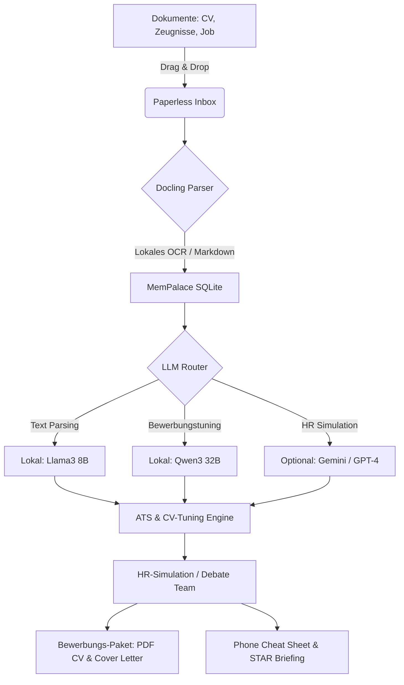

# NALA Career-Ops Desktop (NALA-CV-tUnEr-career-OPS)

  

> **Language / Sprache:** [English](#english) | [Deutsch](#deutsch)

---

## Deutsch

### 🌟 Übersicht & Vision
**NALA Career-Ops Desktop** macht das leistungsstarke, KI-gesteuerte Jobsuche- und Bewerbungs-System von [career-ops](https://github.com/santifer/career-ops) für jedermann nutzbar. Mit einer modernen, lokalen Benutzeroberfläche (Windows 11 Fluent Look) können Dokumente einfach per Drag-and-Drop verarbeitet werden.

Das System integriert den **NALA-CV-Tuner**, **Docling** für intelligente Dokumentenanalyse, **MemPalace** für persönliche Karrierehistorie, **NALA-MCP** für die NALA-Systemintegration und **Ollama** für vollkommen lokale KI-Modelle.

---

### 📦 Download & Installation (Kein Terminal benötigt!)
> [!IMPORTANT]
> Sie müssen **keinen** Programmcode selbst kompilieren oder NodeJS installieren.
> Fertige Installationspakete finden Sie direkt unter **GitHub Releases**:
> - 💾 **Windows:** `NALA-Career-Ops-Setup.exe` (Doppelklick zum Installieren)
> - 🍏 **macOS:** `NALA-Career-Ops.dmg` (In Programme-Ordner ziehen)
> - 🐧 **Linux:** `NALA-Career-Ops.AppImage` (Ausführbar machen und starten)

---

### 🦧 CaveMAN Modus (Einfache Anleitung)
*Für Anwender, die eine schnelle, unkomplizierte Lösung ohne Fachbegriffe suchen.*

1. **Öffnen:** Doppelklicken Sie auf das installierte Programmsymbol auf Ihrem Desktop.
2. **KI verbinden:** Gehen Sie zu den **Einstellungen** (Zahnrad-Symbol) und wählen Sie **Ollama** (für lokale KI) oder tragen Sie Ihren **Gemini/ChatGPT API-Schlüssel** ein.
3. **Dokumente ablegen:** Ziehen Sie Ihren aktuellen Lebenslauf (CV), Arbeitszeugnisse und die Stellenanzeige (PDF oder Textdatei) direkt in die **große grüne Box (Inbox)**.
4. **Optimieren:** Klicken Sie auf **"Bewerbung optimieren"**.
5. **Ergebnis:** Das Programm erstellt automatisch einen verbesserten Lebenslauf, ein Anschreiben und einen Telefon-Spickzettel (Cheat Sheet).

---

### 🧠 Experte Modus (Technische Details)
*Für Entwickler und Power-User, die Pfade, Sicherheitslimits und Architekturen anpassen möchten.*

#### 📁 Lokale Datenpfade
- **Konfigurationsdaten:** `%APPDATA%/Nala-Career-Ops/settings.json` (Windows) oder `~/Library/Application Support/Nala-Career-Ops/settings.json` (macOS).
- **Lokale Datenbank (MemPalace & Inbox):** SQLite-Datenbank unter `%LOCALAPPDATA%/Nala-Career-Ops/db/career_ops.sqlite`.

#### 🔌 Ports & Dienste
- **Ollama API:** Standardmäßig unter `http://localhost:11434`.
- **NALA-MCP Core:** Standardverbindung unter `http://localhost:3000` (Read-only standardmäßig).

#### 🛡️ Datenschutz & Git-Sicherheit (R3-Protokoll)
Dieses Repository enthält ein striktes Pre-Commit-Skript (`scripts/git-gate.js`). Es durchsucht alle Code-Änderungen auf sensible Personendaten, Bilder, private API-Schlüssel oder absolute Pfade vor dem Push auf GitHub, um Datenlecks zu verhindern.

---

### 🗺️ Arbeitsablauf (Mermaid Diagramm)

---

### ❓ FAQ (Häufige Fragen)
* **Kostet die Nutzung etwas?** Nein. Wenn Sie Ollama mit lokalen Modellen nutzen, ist die App zu 100 % kostenlos und offline nutzbar.
* **Wo liegen meine Daten?** Alle Lebensläufe und Texte verbleiben auf Ihrem eigenen Computer in der lokalen SQLite-Datenbank.

---

### ⚠️ Sicherheitshinweise
* Lokale Modelle benötigen eine Grafikkarte (GPU) mit ausreichend Videospeicher (empfohlen: min. 8GB VRAM für 8B-Modelle, 16GB+ VRAM für 32B-Modelle).
* Führen Sie vor einem Git-Commit immer `npm run check-privacy` aus.

---
---

## English

### 🌟 Overview & Vision
**NALA Career-Ops Desktop** turns the powerful, AI-driven job search and application pipeline from [career-ops](https://github.com/santifer/career-ops) into an accessible desktop application. Featuring a modern, local user interface styled in Windows 11 Fluent Design, documents can be processed seamlessly via drag-and-drop.

The app integrates **NALA-CV-Tuner**, **Docling** for document understanding, **MemPalace** for personal career history, **NALA-MCP** for ecosystem connectivity, and **Ollama** for running 100% local AI models.

---

### 📦 Download & Installation (No Terminal Required!)
> [IMPORTANT]
> You do **not** need to compile any code or install NodeJS manually.
> Pre-compiled installation packages are available directly via **GitHub Releases**:
> - 💾 **Windows:** `NALA-Career-Ops-Setup.exe` (Double-click to install)
> - 🍏 **macOS:** `NALA-Career-Ops.dmg` (Drag to Applications folder)
> - 🐧 **Linux:** `NALA-Career-Ops.AppImage` (Make executable and run)

---

### 🦧 CaveMAN Mode (Quick Start Guide)
*For users looking for a simple, jargon-free way to run the application.*

1. **Open:** Double-click the program icon on your desktop.
2. **Connect AI:** Go to **Settings** (gear icon) and select **Ollama** (local AI) or enter your **Gemini/ChatGPT API key**.
3. **Drop Files:** Drag your current CV, certificates, and the job description (PDF or text files) directly into the **large green box (Inbox)**.
4. **Optimize:** Click **"Optimize Application"**.
5. **Get Results:** The program automatically generates an optimized CV, a tailored cover letter, and a phone cheat sheet.

---

### 🧠 Expert Mode (Technical Details)
*For developers and power users interested in paths, safety limits, and architectures.*

#### 📁 Local Paths
- **Config Storage:** `%APPDATA%/Nala-Career-Ops/settings.json` (Windows) or `~/Library/Application Support/Nala-Career-Ops/settings.json` (macOS).
- **SQLite Database (MemPalace & Inbox):** `%LOCALAPPDATA%/Nala-Career-Ops/db/career_ops.sqlite`.

#### 🔌 Ports & Services
- **Ollama API:** Default endpoint `http://localhost:11434`.
- **NALA-MCP Core:** Default endpoint `http://localhost:3000` (read-only by default).

#### 🛡️ Privacy & Git Security (R3 Protocol)
This repository includes a strict pre-commit script (`scripts/git-gate.js`). It scans all staged changes for sensitive personal data, photos, API keys, or absolute system paths before pushing to GitHub.

---

### 🗺️ Workflow (Mermaid Diagram)

*Please refer to the diagram in the German section above.*

---

### ❓ FAQ (Frequently Asked Questions)
* **Is this free to use?** Yes. If you use Ollama with local models, the app is 100% free and runs entirely offline.
* **Where is my data stored?** All your resumes, certificates, and analysis results remain on your local computer inside the SQLite database.

---

### ⚠️ Safety Notes
* Local models require a compatible GPU with sufficient video memory (min. 8GB VRAM for 8B models, 16GB+ VRAM for 32B models recommended).
* Always run `npm run check-privacy` before committing code to Git.
